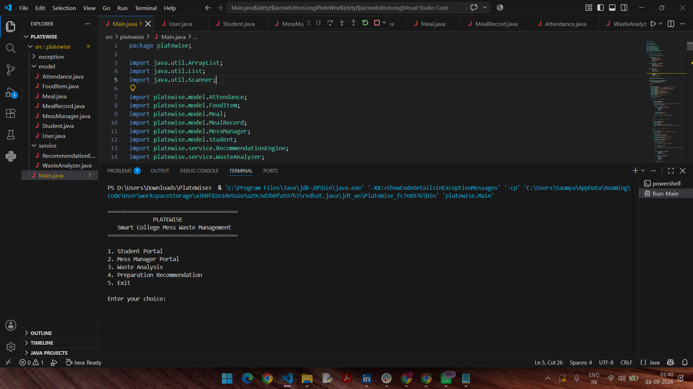
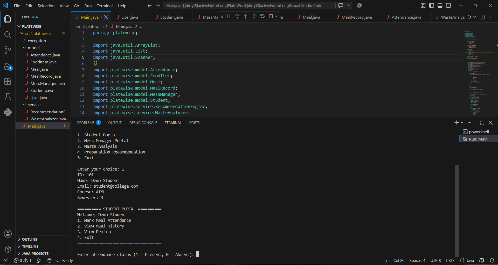
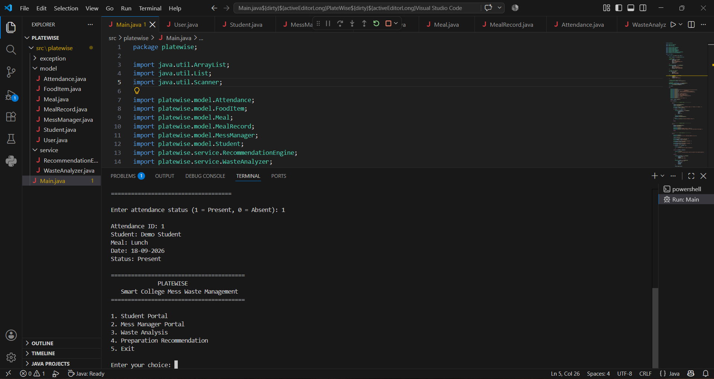
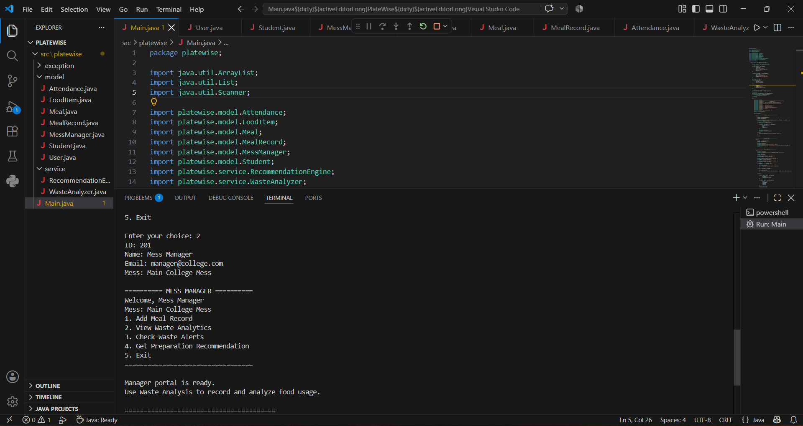
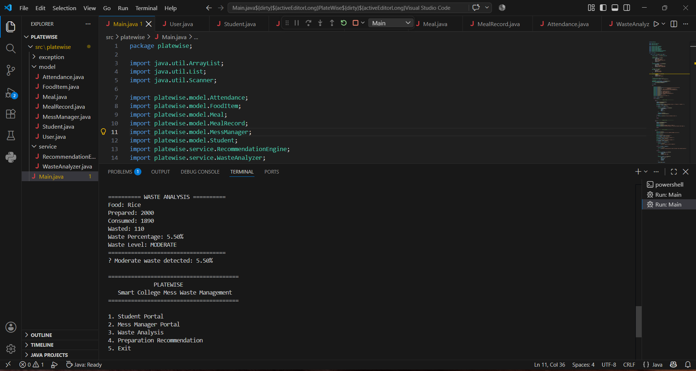
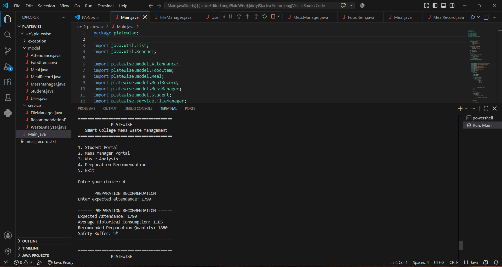
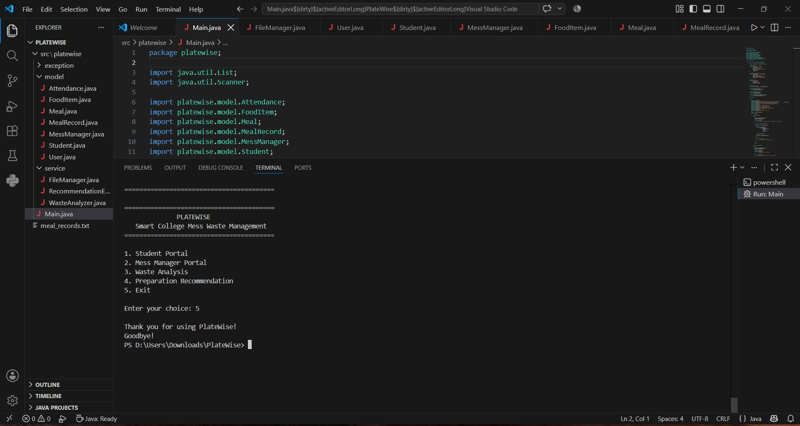

# PlateWise

## Smart College Mess Food Waste Management System

PlateWise is a Java-based console application designed to help college messes manage meal records, analyze food waste, and make preparation recommendations based on historical consumption.

The system helps mess managers monitor the quantity of food prepared, consumed, and wasted while providing waste-level alerts and preparation recommendations.

## Features

- Student and Mess Manager management
- Meal and food item management
- Meal attendance recording
- Food waste calculation
- Waste percentage analysis
- Waste classification as Low, Moderate, or High
- Waste alerts
- Waste history and analytics
- Preparation quantity recommendation
- File-based storage of meal records

## Technologies Used

- Java
- Object-Oriented Programming
- ArrayList and Java Collections
- File I/O
- Exception Handling
- Console-based User Interface
- Github
- VS Code

## Project Structure

```text
PlateWise/
│
├── src/
│   └── platewise/
│       ├── Main.java
│       │
│       ├── model/
│       │   ├── User.java
│       │   ├── Student.java
│       │   ├── MessManager.java
│       │   ├── FoodItem.java
│       │   ├── Meal.java
│       │   ├── MealRecord.java
│       │   └── Attendance.java
│       │
│       └── service/
│           ├── FileManager.java
│           ├── WasteAnalyzer.java
│           └── RecommendationEngine.java
│
└── meal_records.txt
```

## How the System Works

1. The user starts the PlateWise application.
2. The main menu displays the available operations.
3. Students can access the Student Portal and manage meal attendance.
4. Mess managers can manage meal records and food information.
5. The system calculates the amount of food wasted.
6. Waste percentage is calculated using the prepared and consumed quantities.
7. The system classifies waste into Low, Moderate, or High levels.
8. Waste alerts are displayed according to the calculated waste level.
9. Historical meal records are used to calculate average consumption.
10. The system uses expected attendance and historical consumption to recommend a preparation quantity.
11. Meal records are stored in `meal_records.txt`.

## Waste Calculation

Food waste is calculated using:

**Waste = Quantity Prepared - Quantity Consumed**

Waste percentage is calculated using:

**Waste Percentage = (Waste / Quantity Prepared) × 100**

The system uses predefined thresholds to classify the waste level as Low, Moderate, or High.

Preparation Recommendation
PlateWise uses historical consumption records and expected attendance to recommend a preparation quantity.

A safety buffer is included in the recommendation to reduce the possibility of insufficient food while avoiding unnecessary overproduction.
Installation and Running
Prerequisites
Java Development Kit (JDK)
Java compiler (javac)
Command-line terminal
Compile the Project

Open a terminal in the PlateWise project directory and run:

javac -d out src/platewise/*.java src/platewise/model/*.java src/platewise/service/*.java
Run the Project
java -cp out platewise.Main
Testing Instructions

The application can be tested through the console menu.

Test 1: Student Portal
Start the application.
Select option 1.
Enter the required student and attendance information.
Verify that the student information and attendance details are displayed correctly.

Test 2: Mess Manager Portal
Start the application.
Select option 2.
Enter the required meal and food information.
Verify that the meal record is created and saved successfully.

Test 3: Waste Analysis
Select the Waste Analysis option.
Enter prepared and consumed quantities.
Verify that the system calculates:
Quantity wasted
Waste percentage
Waste level
Check that the corresponding waste alert is displayed.

Test 4: Preparation Recommendation
Select the Preparation Recommendation option.
Enter the expected attendance.
The system uses historical consumption records to calculate the average consumption.
Verify that a recommended preparation quantity is displayed.

Test 5: File Storage
Add a meal record.
Exit and restart the application.
Verify that previously saved meal records are loaded from meal_records.txt.

The preview of the main menu is given below:
========================================
              PLATWISE
   Smart College Mess Waste Management
========================================

1. Student Portal
2. Mess Manager Portal
3. Waste Analysis
4. Preparation Recommendation
5. Exit

Enter your choice:

Purpose

The purpose of PlateWise is to provide a simple software-based solution for managing food consumption and waste in college messes.

By maintaining meal records and analyzing consumption patterns, the system can help mess managers make better food preparation decisions and reduce unnecessary food wastage.

## Future Scope

1. Integration with a database such as JDBC or JPA for structured data storage.
2. Development of a graphical user interface for easier interaction.
3. Addition of user authentication and role-based access.
4. Generation of detailed meal and food waste reports.
5. Addition of visual charts and dashboards for waste analysis.
6. Integration with real-time attendance systems.
7. Expansion of the system to support multiple college messes.

## Screenshots

### Main Menu


### Student Attendance


### Student Attendance 1


### Mess Manager


### Waste Analysis


### Preparation Recommendation


### User Exit

